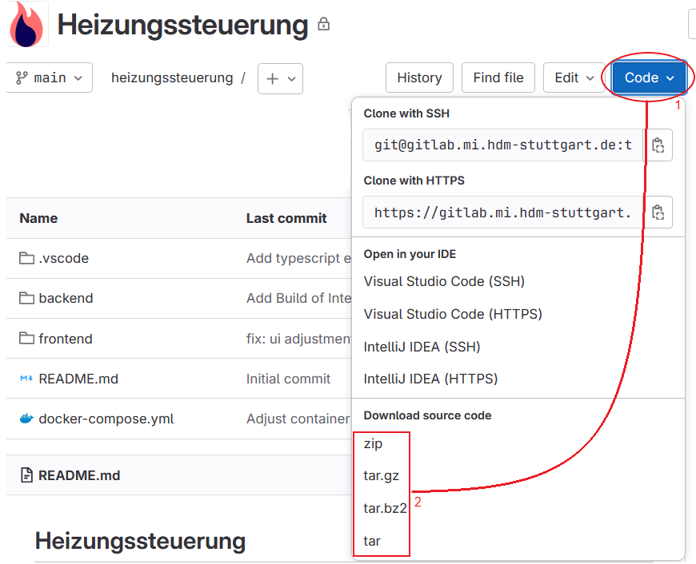
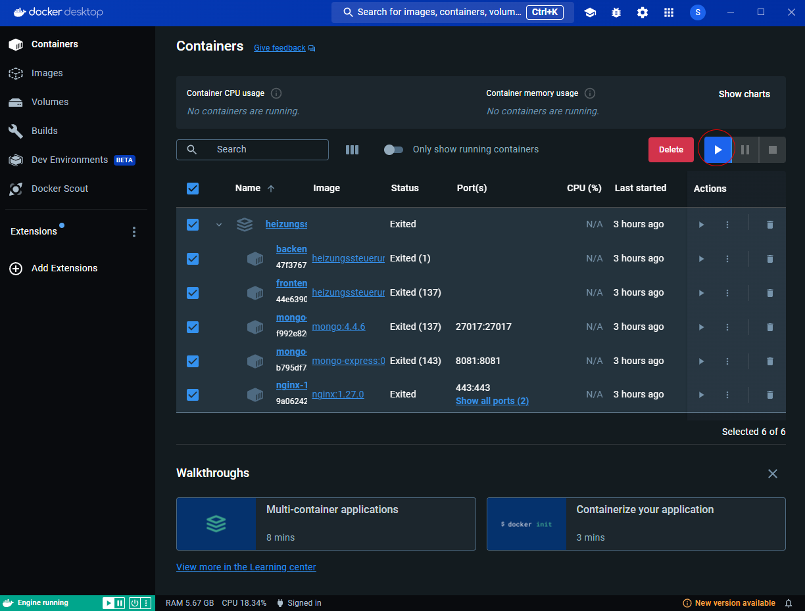
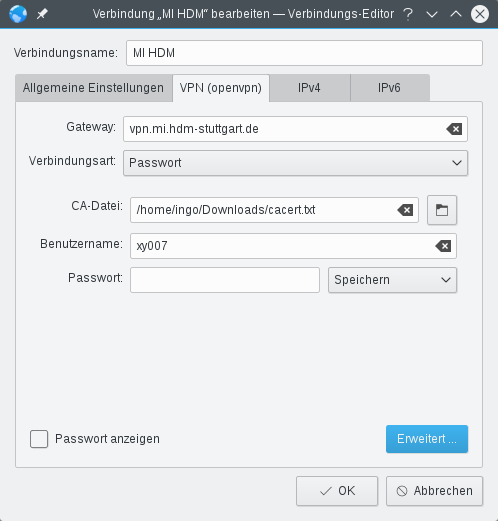
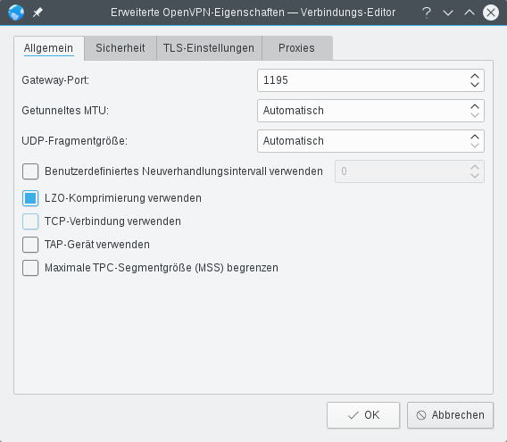

# Installationsanleitung

- [Installationsanleitung](#installationsanleitung)
    - [1. Voraussetzungen](#1-voraussetzungen)
    - [2. Installation von Node.js und npm](#2-installation-von-nodejs-und-npm)
    - [3. Docker und Docker Compose Installationsanleitung](#3-docker-und-docker-compose-installationsanleitung)
    - [4. Schnellstart](#4-schnellstart)
    - [5. User Management per Datenbank-Oberfläche](#5-user-management-per-datenbank-oberfläche)
    - [6. Einrichtung zusätzlicher Heizkörperregler](#6-einrichtung-zusätzlicher-heizkörperregler)
    - [7. Troubleshooting](#7-troubleshooting)
- [Einrichten eines Raspberry Pi 4b als Server](#einrichten-eines-raspberry-pi-4b-als-server)
    - [1. Installation](#1-installation)
    - [2. Update und Upgrade](#2-update-und-upgrade)
    - [3. Aktivieren Sie SSH auf dem Raspberry Pi (optional)](#3-aktivieren-sie-ssh-auf-dem-raspberry-pi-optional)
    - [4. Installieren Sie Docker \& Docker-Compose](#4-installieren-sie-docker--docker-compose)
    - [5. HdM VPN Setup Anleitung (optional)](#5-hdm-vpn-setup-anleitung-optional)
    - [6. Verbindungseinstellungen für Raspberry Pi](#6-verbindungseinstellungen-für-raspberry-pi)
    - [7. Neustart der Netzwerkdienste](#7-neustart-der-netzwerkdienste)
    - [8. Überprüfen Sie die statische IP-Adresse](#8-überprüfen-sie-die-statische-ip-adresse)
    - [9. Verbindung zum Raspberry Pi über SSH](#9-verbindung-zum-raspberry-pi-über-ssh)
    - [10. Zusätzliche Empfehlung für Nutzung des VPNs](#10-zusätzliche-empfehlung-für-nutzung-des-vpns)
    - [11. Troubleshooting](#11-troubleshooting)
      - [Firewall-Einstellungen](#firewall-einstellungen)
    - [12. Optional: Ändern des Hostnamens des Raspberry Pi](#12-optional-ändern-des-hostnamens-des-raspberry-pi)
      - [Hostname ändern:](#hostname-ändern)
      - [Hosts-Datei aktualisieren:](#hosts-datei-aktualisieren)
      - [Starten Sie den Raspberry Pi neu:](#starten-sie-den-raspberry-pi-neu)
      - [Aktualisieren Sie die Hosts-Datei auf anderen Geräten](#aktualisieren-sie-die-hosts-datei-auf-anderen-geräten)
        - [Aktualisieren Sie die Hosts-Datei auf einem Windows-PC:](#aktualisieren-sie-die-hosts-datei-auf-einem-windows-pc)
        - [Aktualisieren Sie die Hosts-Datei auf einem macOS- oder Linux-Gerät:](#aktualisieren-sie-die-hosts-datei-auf-einem-macos--oder-linux-gerät)
      - [Zugriff auf den Raspberry Pi über den Alias](#zugriff-auf-den-raspberry-pi-über-den-alias)

---
### 1. Voraussetzungen

- **Betriebssysteme**: Windows 10 oder höher, MacOS, Linux
- **Software**:
  - Docker [Version: >= 26.9.0] ([Download Docker](https://www.docker.com/get-started))
  - Docker Compose (in Docker Desktop enthalten)
  - Git (optional, [Download Git](https://git-scm.com/downloads))
  - Node.js [Version: >= 20.13.1] ([Download Node](https://nodejs.org/en/download/package-manager/current))
  - npm [Version: >= 10.8.0] ([Download npm](https://nodejs.org/en/download/package-manager/current))

### 2. Installation von Node.js und npm

- **Windows**

  1. Besuchen Sie die [Node.js-Downloadseite](https://nodejs.org/).
  2. Laden Sie die neueste LTS-Version (Long Term Support) von Node.js herunter.
  3. Führen Sie das Installationsprogramm aus und folgen Sie den Anweisungen.
  4. Stellen Sie während der Installation sicher, dass die Option zur Installation von `npm` (Node Package Manager) aktiviert ist.
  5. Überprüfen Sie die Installation, indem Sie eine Terminal öffnen und ausführen:
     ```bash
     node -v
     npm -v
     ```
     Stellen Sie sicher, dass die Version von Node.js > 14 ist und npm installiert ist.

- **MacOS**

  1. Laden Sie die neueste LTS-Version von der [Node.js-Website](https://nodejs.org/) herunter.
  2. Öffnen Sie das heruntergeladene Paket und folgen Sie den Installationsanweisungen.
  3. Überprüfen Sie die Installation im Terminal:
     ```bash
     node -v
     npm -v
     ```
     Stellen Sie sicher, dass die Node.js-Version > 14 ist und npm installiert ist.

- **Linux (Ubuntu)**

  1. Öffnen Sie Ihr Terminal.
  2. Aktualisieren Sie Ihre Paketliste:
     ```bash
     sudo apt update
     ```
  3. Installieren Sie Node.js und npm:
     ```bash
     sudo apt install nodejs npm
     ```
  4. Überprüfen Sie die installierten Versionen:
     ```bash
     node -v
     npm -v
     ```
     Stellen Sie sicher, dass Node.js >10.8.0 ist und npm installiert ist.

### 3. Docker und Docker Compose Installationsanleitung

- **Windows**

  1. **Docker Desktop herunterladen**:

     - Besuchen Sie die [Docker Desktop für Windows Download-Seite](https://www.docker.com/products/docker-desktop).
     - Klicken Sie auf die Schaltfläche "Download for Windows", um das Installationsprogramm herunterzuladen.

  2. **Docker Desktop installieren**:

     - Führen Sie die heruntergeladene `.exe`-Datei aus, um den Installationsprozess zu starten.
     - Folgen Sie den Anweisungen auf dem Bildschirm, um die Installation abzuschließen.
     - Stellen Sie sicher, dass Sie während der Installation die Option "Enable the WSL 2 based engine" aktivieren.

  3. **Starten Sie Docker Desktop**:

     - Starten Sie nach Abschluss der Installation Docker Desktop über das Startmenü.
     - Sie werden möglicherweise aufgefordert, sich mit einer Docker-ID anzumelden oder eine neue ID zu erstellen.

  4. **Überprüfen Sie die Docker-Installation**:

     - Öffnen Sie PowerShell und führen Sie den folgenden Befehl aus:

     ```Powershell
     docker --version
     ```

     - Sie sollten die Docker-Versionsinformationen angezeigt bekommen.

  5. **Überprüfen Sie die Installation von Docker Compose**:
     - Führen Sie den folgenden Befehl aus, um Docker Compose zu überprüfen:
     ```Powershell
     docker-compose --version
     ```
     - Docker Compose ist im Lieferumfang von Docker Desktop enthalten, und Sie sollten die Versionsinformationen sehen.

- **MacOS**

  1. **Docker Desktop für Mac herunterladen**:

     - Besuchen Sie die [Docker Desktop für Mac Download-Seite](https://www.docker.com/products/docker-desktop).
     - Klicken Sie auf die Schaltfläche "Download for Mac", um das Installationsprogramm herunterzuladen.

  2. **Installieren Sie Docker Desktop**:

     - Öffnen Sie die heruntergeladene `.dmg`-Datei.
     - Ziehen Sie das Docker-Symbol in den Ordner "Programme".

  3. **Starten Sie Docker Desktop**:

     - Öffnen Sie Docker Desktop aus dem Ordner "Programme".
     - Möglicherweise müssen Sie Docker Berechtigungen für den Zugriff auf Ihre Dateien und Netzwerke erteilen.
     - Melden Sie sich mit Ihrer Docker-ID an oder erstellen Sie eine neue, wenn Sie dazu aufgefordert werden.

  4. **Überprüfen Sie die Docker-Installation**:

     - Öffnen Sie Terminal und führen Sie den folgenden Befehl aus:
       ```bash
       docker --version
       ```
     - Sie sollten die Docker-Versionsinformationen angezeigt bekommen.

  5. **Überprüfen Sie die Installation von Docker Compose**:
     - Führen Sie den folgenden Befehl aus, um Docker Compose zu überprüfen:
       ```bash
       docker-compose --version
       ```
     - Docker Compose ist im Lieferumfang von Docker Desktop enthalten, und Sie sollten die Versionsinformationen sehen.

- **Linux**

  - Befolgen Sie die [offizielle Docker-Dokumentation](https://docs.docker.com/engine/install) Anleitung.

  1. **Überprüfen Sie die Docker-Installation**:

     - Öffnen Sie Terminal und führen Sie den folgenden Befehl aus:
       ```bash
       docker --version
       ```
     - Sie sollten die Informationen zur Docker-Version angezeigt bekommen.

  2. **Überprüfen Sie die Installation von Docker Compose**:
     - Ausführen:
       ```bash
       docker-compose --version
       ```
     - Sie sollten die Versionsinformationen von Docker Compose sehen.

### 4. Schnellstart

1. **Repository klonen**:

   ```bash
   git clone https://gitlab.mi.hdm-stuttgart.de/tz023/heizungssteuerung.git
   ```

   Oder alternativ als Zip-Datei herunterladen und entpacken.
   

2. **Konfiguration der Umgebungsvariablen**:
   Um die Anwendung betriebsbereit zu machen, ist es erforderlich die Zugangsdaten für die Fritz!Box und den Nextcloud Kalender in den Umgebungsvariablen (engl. **Env**ironment Variables) zu setzen. Hierfür muss das Konfigurations-File `./backend/.env.docker` angepasst werden.

   Folgende Vaiablen müssen gesetzt werden, diese sollten bereits vorhanden sein:

   ```txt
        # Fritzbox
        FRITZ_ADDRESS=http://fritz.box
        FRITZ_USERNAME=admin
        FRITZ_PASSWORD=???

        # NextCloud calender
        CALENDAR_DOMAIN=https://cloud.mi.hdm-stuttgart.de
        CALENDAR_USERNAME=hdm-abbreviation
        CALENDAR_PASSWORD=XXXX
        CALENDAR_NAME_HEIZUNGSSTEUERUNG=Heizungssteuerung
   ```

   Die Domains des Kalenders und der Fritz!Box sind für den Use-Case im PUXLab bereits definiert. Bei der Fritz!Box ist das Passwort und der Username der Web-Oberfläche des Gerät erforderlich. Beim Kalender muss ein valider HdM-Benutzer eingetragen werden, die `hdm-abbreviation`ist das Kürzel des Nutzer **ohne** `@hdm-stuttgart.de`, bspw. `ab123`.

3. **NPM Packages installieren (lokal)**:
   Für den Betrieb mit Docker bzw. Docker Compose ist dieser Schritt nicht erforderlich. Sobald das System zu Entwicklungszwecken lokal ohne Docker betrieben werden soll, müssen die nächsten Schritte ausgeführt werden.

   - Terminal öffnen und in das backend-Verzeichnis navigieren:
     ```bash
     cd backend
     ```
   - Anschließend benötigte Packages installieren:
     ```bash
     npm install
     ```
   - Zweites Terminal öffnen und in das frontend-Verzeichnis navigieren:
     ```bash
     cd frontend
     ```
   - Anschließend benötigte Packages installieren:
     ```bash
     npm install
     ```
   Über diesen Weg muss kein Docker Container gestartet werden und der nächste Schritt kann ausgelassen werden.

4. **Docker Container starten**:

   - Docker starten.
   - Terminal öffnen und in das Repository-Verzeichnis navigieren:

     ```bash
     cd heizungssteuerung
     docker compose up
     ```

     Alternativ kann auch über die Docker Desktop App die Container gestartet werden:
     

   - Die Heizungssteuerung ist verfügbar unter: `http://localhost`.

5. **User Verwaltung**:

   - Beim ersten Start der Anwendung sind zwei User vorhanden.

     1. Username: `admin`, Passwort: `admin`, mit Administrator Berechtigungen
     2. Username: `user`, Passwort: `user`, ohne Administrator Berechtigungen

   - Weitere Admins lassen sich in der Datenbank per Skript setzen:

     ```bash
     ts-node ./backend/src/setAdmin.ts [username]
     ```

     Für diesen Schritt ist das Installieren der NPM Packages lokal erforderlich!

   - Über die Datenbank-Oberfläche, welche Sie unter `http://localhost:8081` erreichen können, kann User-Management vorgenommen werden. Siehe [User Management per Datenbank-Oberfläche](#User-Management-per-Datenbank-Oberfläche).

   - Für Anwendungen, die produktiv Betrieben werden, wird empfohlen die Default-User `admin` und `user` zu löschen und neue Admins anzulegen.

### 5. User Management per Datenbank-Oberfläche

In Docker Compose startet mit dem MongoDB Datenbank Server eine Mongo-Express User-Oberfläche für die Datenbank.
Sie ist zu finden unter: `http://localhost:8081`, alternativ kann über die Domain der Anwendung bspw. `http://heizungssteuerung:8081` von einem fremden Gerät zugegriffen werden.

Für die Oberfläche ist ein Login erforderlich, die Zugangsdaten werden im File `./docker-compose.yml` definiert und sind standardmäßig `admin:smarthome`.

Auf der Oberfläche kann User Management innerhalb der `User` Collection der Datenbank `Heizungssteuerung` vorgenommen werden, indem die Einträge der Collection angepasst werden.

Im Video ist zu sehen, wie der Login durchzuführen ist, wie eine Collection am Beispiel des Admin-Values angepasst werden kann und wie ein User gelöscht wird.

- [Link zum Video](../resources/video/database_user_management.mp4)
- [Link für exportierte PDFs](https://gitlab.mi.hdm-stuttgart.de/tz023/heizungssteuerung/-/wikis/resources/video/database_user_management.mp4)

### 6. Einrichtung zusätzlicher Heizkörperregler

- Es können beliebig viele Heizkörperregler hinzugefügt werden. Jeder Heizkörperregler muss im ersten Schritt an die Fritzbox angeschlossen werden und kann danach per User Interface zur Heizungssteuerung hinzugefügt werden. Orientieren Sie sich an der [Betriebsanleitung](https://avm.de/service/fritzdect/wissensdatenbank/?product=FRITZ-DECT-301&query=) (engl. User Manual) des jeweiligen Heizkörperregler, für weitere Infos zum Vorgehen beim Hinzufügen im User Interface.

### 7. Troubleshooting

- **Docker Compose Fehler**: Prüfen Sie, ob Docker auf dem Hostrechner gestartet wurde und aktiv ist.
- **Admin-User Fehler**: Prüfen Sie, ob Sie den korrekten Usernamen eingegeben haben. Im Zweifel, probieren Sie eine neue Registrierung.

---

---

# Einrichten eines Raspberry Pi 4b als Server

Im Folgenden wird beschrieben, wie die Anwendung speziell auf einem Raspberry Pi 4b als Server in einem lokalen Netzwerk, wie dem PUXLab, eingerichtet werden kann.


### 1. Installation

- Raspberry Pi mit einem laufenden [Raspbian OS](https://www.raspberrypi.com/software/).
- Zugang zum Raspberry Pi entweder über eine physische Verbindung oder über SSH.

### 2. Update und Upgrade

Vergewissern Sie sich zunächst, dass auf dem System die neueste Version der Software läuft. Führen Sie den Befehl aus:

```bash
sudo apt-get update && sudo apt-get upgrade
```

### 3. Aktivieren Sie SSH auf dem Raspberry Pi (optional)

(falls nicht während des Installationsprozesses aktiviert)

1. Öffnen Sie das **Terminal** auf Ihrem Raspberry Pi.
2. Geben Sie den folgenden Befehl ein, um das Raspberry Pi Konfigurationstool zu öffnen:
   ```bash
   sudo raspi-config
   ```
3. Navigieren Sie zu **Interfacing Options** > **SSH** und aktivieren Sie SSH.
4. Beenden Sie das Konfigurationstool.

### 4. Installieren Sie Docker & Docker-Compose

1. Geben Sie den folgenden Befehl ein, um das Docker-Installationsskript zu erhalten:
   ```bash
   curl -fsSL test.docker.com -o get-docker.sh && sh get-docker.sh
   ```
2. Fügen Sie einen Nicht-Root-Benutzer zur Docker-Gruppe hinzu (falls erforderlich)

   ```bash
   sudo usermod -aG docker ${USER}
   ```

3. Starten Sie den Raspberry Pi neu
4. Installieren Sie Docker-Compose
   ```bash
   sudo apt-get install libffi-dev libssl-dev
   sudo apt install python3-dev
   sudo apt-get install -y python3 python3-pip
   ```
   Nach der Installation von python3 und pip3:
   ```bash
   sudo pip3 install docker-compose
   ```
5. Aktivieren Sie das Docker-System
   ```bash
   sudo systemctl enable docker
   ```

### 5. HdM VPN Setup Anleitung (optional)

Falls Sie sich über die HdM VPN verbinden wollen, müssen folgende Schritte ausgeführt werden.

Ausführliche Informationen finden Sie im [HdM VPN Wiki](https://wiki.mi.hdm-stuttgart.de/doku.php?id=studium:infrastruktur:vpn).

1. **OpenVPN installieren**

   - Installieren Sie OpenVPN über Ihren Paketmanager, wenn es nicht bereits installiert ist. Sie können auch die Kommandozeile für die Installation verwenden.

   ```bash
   sudo apt-get install openvpn
   ```

2. **Erstellen einer OpenVPN-Verbindung**

   - Öffnen Sie den Verbindungseditor.
   - Klicken Sie auf die Schaltfläche "Hinzufügen" und wählen Sie "OpenVPN" unter dem Abschnitt "VPN".
   - Geben Sie der Verbindung einen Namen und setzen Sie das Gateway auf `mi-vpn.mi.hdm-stuttgart.de`.

3. **Geben Sie Ihre Zugangsdaten ein**

   - Geben Sie Ihren HdM-Benutzernamen und Ihr Passwort ein.
   - Wählen Sie, ob das Passwort dauerhaft gespeichert werden soll oder ob Sie bei jeder Verbindung dazu aufgefordert werden möchten.

4. **Erweiterte Einstellungen**

   - Klicken Sie auf "Erweitert".
   - Setzen Sie den Port auf "1197" für Mitarbeiter oder "1198" für Studenten.
   - Aktivieren Sie "LZO-Datenkompression verwenden".

5. **Speichern und Verbinden**
   - Speichern Sie die Verbindungseinstellungen.
   - Sie können nun die VPN-Verbindung nutzen, indem Sie sie im Netzwerkmanager auswählen.

Wenn Sie diese Schritte befolgen, können Sie das HdM-VPN einrichten und verwenden. Denken Sie daran, dass ca.crt als Zertifikat für Linux-Systeme benötigt wird.




### 6. Verbindungseinstellungen für Raspberry Pi
Dieser Schritt ist essenziell, da sonst immer verschiedene IP-Adresse dem Raspberry Pi zugewiesen werden, was die Ansteuerung der Heizungssteuerung erschwert.

1. Öffnen Sie das **Terminal** auf Ihrem Raspberry Pi.
2. Geben Sie den folgenden Befehl ein, um die aktuelle IP-Adresse zu ermitteln:
   ```bash
   hostname -I
   ```
3. Geben Sie den folgenden Befehl ein, um die aktuelle IP-Adresse Ihres Routers zu ermitteln:
   ```bash
   ip r | grep default
   ```
4. Öffnen Sie die **Netzwerkeinstellungen**:
   - Klicken Sie auf das Netzwerksymbol in der oberen rechten Ecke des Bildschirms und wählen Sie **Wireless & Wired Network Settings**.
5. Wählen Sie die Netzwerkschnittstelle aus, die Sie konfigurieren möchten (z. B. "wlan0" für Wi-Fi oder "eth0" für Ethernet).
6. Ändern Sie die Methode **IPv4-Adresse konfigurieren** in **Manuell**.
7. Geben Sie die gewünschte statische IP-Adresse, Netzmaske, Gateway und DNS ein.
   - Beispielhafte Einstellungen:
     - IP-Adresse: `192.168.2.113` (Gewählte statische IP-Adresse)
     - Netzmaske: `255.255.255.0`
     - Gateway: `192.168.2.1` (IP-Adresse des Routers)
     - DNS-Server: `192.168.2.1` (IP-Adresse des Routers)
8. Klicken Sie auf **Anwenden**, um die Änderungen zu speichern.

### 7. Neustart der Netzwerkdienste

1. Öffnen Sie das **Terminal** auf Ihrem Raspberry Pi.
2. Starten Sie den Netzwerkdienst neu, um die Änderungen zu übernehmen:
   ```bash
   sudo systemctl restart networking
   ```

### 8. Überprüfen Sie die statische IP-Adresse

1. Öffnen Sie das **Terminal** auf Ihrem Raspberry Pi.
2. Geben Sie den folgenden Befehl ein, um die IP-Adresse zu überprüfen:
   ```bash
   hostname -I
   ```

### 9. Verbindung zum Raspberry Pi über SSH

1. Öffnen Sie von einem anderen Computer im selben Netzwerk ein Terminal oder eine Eingabeaufforderung.
2. Verwenden Sie den folgenden Befehl, um sich mit Ihrem Raspberry Pi über SSH zu verbinden:
   ```bash
   ssh rasp@192.168.2.113
   ```
   - Ersetzen Sie `192.168.2.113` durch die statische IP-Adresse, die Sie konfiguriert haben.

### 10. Zusätzliche Empfehlung für Nutzung des VPNs

Falls Sie einen VPN-Zugang verwenden, können noch zusätzliche Optionen für eine angenehme Nutzererfarhung aktiviert werden.

- Navigieren Sie zu:
  - **Verbindungen**
  - -> **Erweiterte Optionen**
  - -> **Verbindungen bearbeiten**
  - -> **PUXLab** oder **Ethernet-Verbindung**
  - -> **Allgemein**
  - -> Haken bei **Automatische VPN-Verbindung** setzen

Dadurch wird nach dem Hochfahren des Raspberry Pis automatisch bei vorhandener Internetverbindung der VPN-Zugang aktiviert. 
### 11. Troubleshooting

#### Firewall-Einstellungen

Stellen Sie sicher, dass Ihre Firewall den SSH-Port nicht blockiert (Standard ist 22). Sie können den SSH-Port mit den folgenden Befehlen für die Firewall freigeben:

- **UFW (Uncomplicated Firewall) auf Raspberry Pi:**
  ```bash
  sudo apt-get install ufw
  sudo ufw allow 22/tcp
  sudo ufw aktivieren
  sudo ufw status
  ```

### 12. Optional: Ändern des Hostnamens des Raspberry Pi

Wenn Sie nicht über eine IP-Adresse auf die Heizungssteuerung zugreifen möchten, können Sie den Hostnamen des Raspberry Pi ändern:

#### Hostname ändern:

1. Bearbeiten Sie die Datei `/etc/hostname`:
   ```bash
   sudo nano /etc/hostname
   ```
2. Ändern Sie den Inhalt in den gewünschten Hostnamen, z.B. `Heizungssteuerung`.
3. Speichern und schließen Sie die Datei.

#### Hosts-Datei aktualisieren:

1. Bearbeiten Sie die Datei `/etc/hosts`:
   ```bash
   sudo nano /etc/hosts
   ```
2. Fügen Sie eine Zeile hinzu oder aktualisieren Sie die bestehende Zeile, die `127.0.1.1` enthält:
   ```bash
   127.0.1.1 heizungssteuerung
   ```
3. Speichern und schließen Sie die Datei.

#### Starten Sie den Raspberry Pi neu:

1. Starten Sie den Raspberry Pi neu, um die Änderungen zu übernehmen:
   ```bash
   sudo reboot
   ```

#### Aktualisieren Sie die Hosts-Datei auf anderen Geräten

Um den Raspberry Pi von anderen Geräten im Netzwerk unter dem neuen Hostnamen zu erreichen, müssen Sie die Hosts-Datei auf diesen Geräten aktualisieren.

##### Aktualisieren Sie die Hosts-Datei auf einem Windows-PC:

1. Öffnen Sie den Editor als Administrator.
2. Bearbeiten Sie die Datei `C:\Windows\System32\drivers\etc\hosts`.
3. Fügen Sie die folgende Zeile hinzu:
   ```plaintext
   192.168.2.113 heizungssteuerung
   ```
   - Ersetzen Sie `192.168.2.113` durch Ihre konfigurierte statische IP-Adresse
4. Speichern Sie die Datei und schließen Sie den Editor.

##### Aktualisieren Sie die Hosts-Datei auf einem macOS- oder Linux-Gerät:

1. Öffnen Sie ein Terminal.
2. Bearbeiten Sie die Datei `/etc/hosts` mit einem Texteditor:
   ```bash
   sudo nano /etc/hosts
   ```
3. Fügen Sie die folgende Zeile ein:
   ```plaintext
   192.168.2.113 heizungssteuerung
   ```
   - Ersetzen Sie `192.168.2.113` durch Ihre konfigurierte statische IP-Adresse
4. Speichern und schließen Sie die Datei.

#### Zugriff auf den Raspberry Pi über den Alias

Nachdem Sie die hosts-Datei auf den anderen Geräten im Netzwerk aktualisiert haben, sollten Sie in der Lage sein, auf den Raspberry Pi über den neuen Hostnamen zuzugreifen:

```plaintext
https://heizungssteuerung
```
