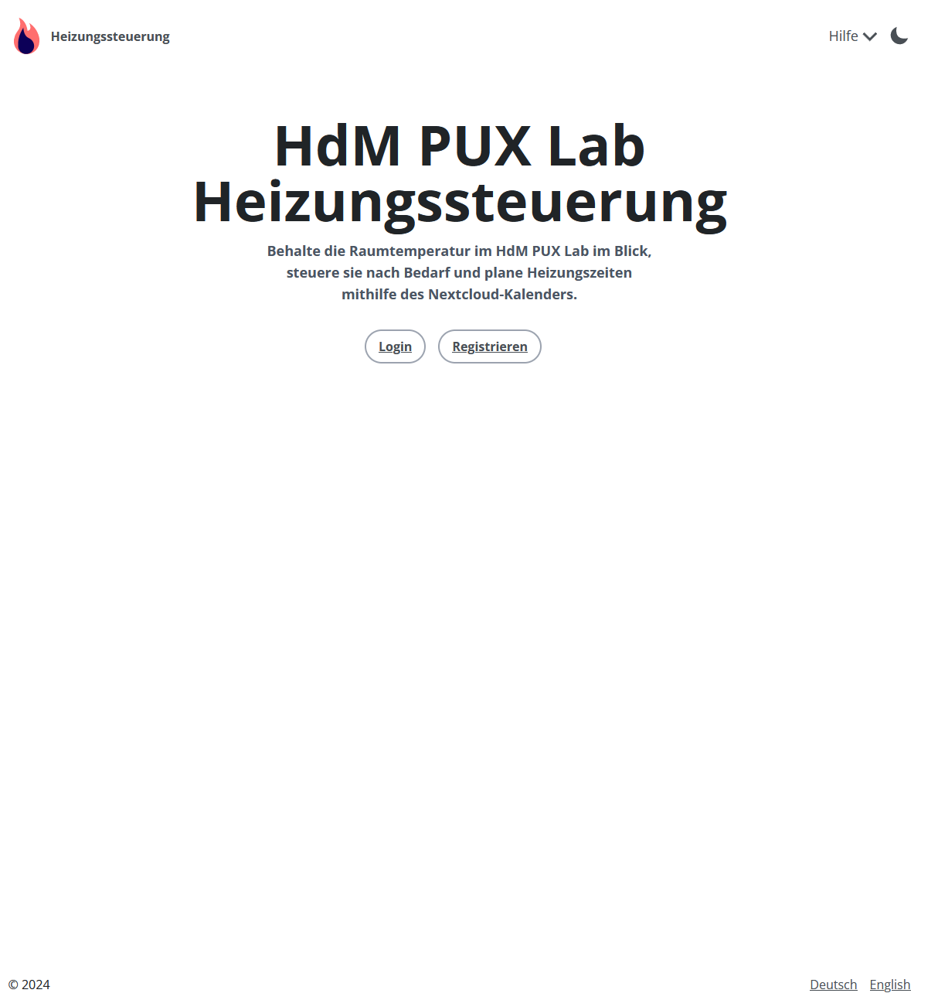
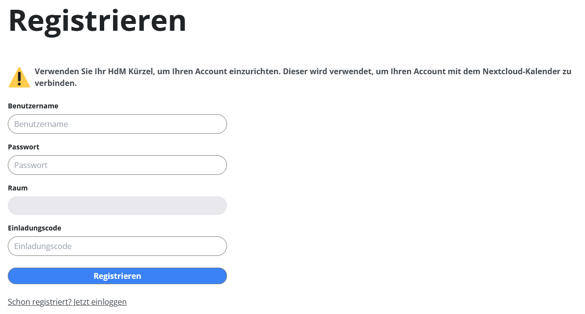
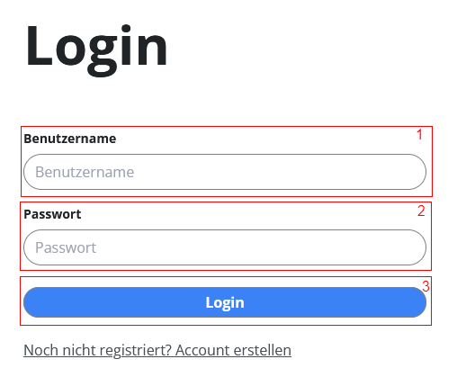
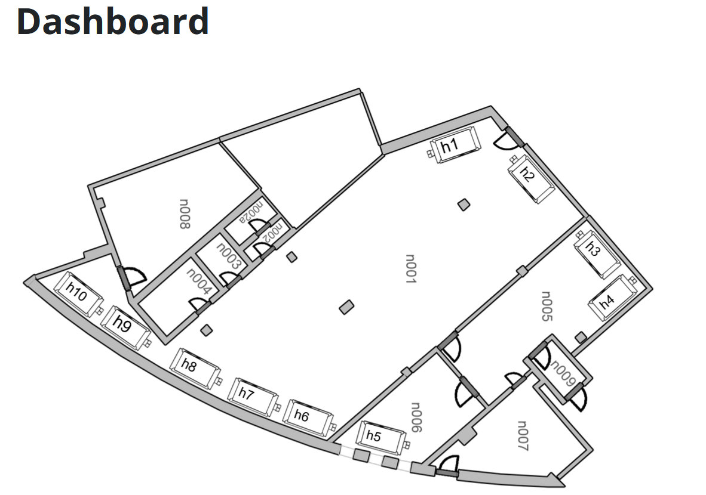
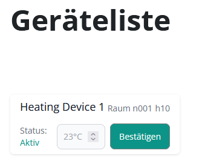
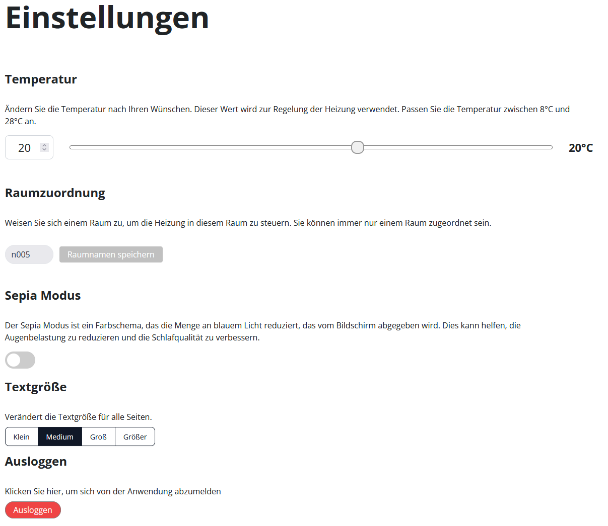
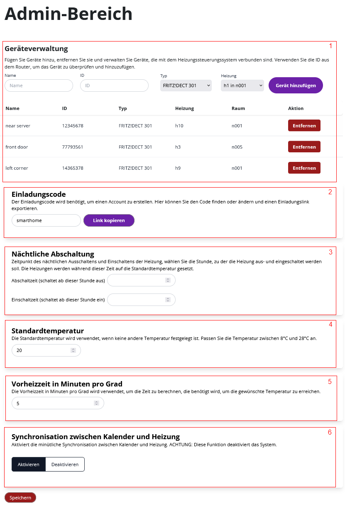

# Inhaltsverzeichnis

- [Bedienungsanleitung](#bedienungsanleitung)
  - [Docker Container starten](#docker-container-starten)
  - [Homepage](#homepage)
  - [Registrieren](#registrieren)
  - [Login](#login)
  - [Dashboard](#dashboard)
  - [Einstellungen](#einstellungen)
  - [Admin-Bereich](#admin-bereich)
  - [Troubleshooting](#troubleshooting)

---

# Bedienungsanleitung

## Docker Container starten

- Starte die Docker Container über Docker Compose:
  ```bash
  docker-compose up
  ```
- Wenn aktiv, gehen Sie auf `http://localhost:4321` im Browser.

---

## Homepage



1. Die Einstellung der Sprache zwischen Deutsch und Englisch finden Sie unten rechts.
2. Oben rechts befindet sich der Hilfeaufruf, welcher die Bedienungsanleitung, Installationsanleitung und die Infos zum Quellcode verlinkt.
   - Zusätzlich können Sie mit dem Sonnen/Mond-Symbol den Darkmode ein- bzw. ausschalten.
3. In der Mitte befinden sich der Login- und der Registrieren-Button.

---

## Registrieren



1. Sind Sie ein neuer Nutzer, brauchen Sie den Einladungscode von einem Admin.
2. Geben Sie Ihr HdM-Kürzel als Benutzernamen an (z.B. ab12).
3. Geben Sie ein Passwort ein, das mindestens eine Zeichenlänge von 7 hat.
4. Wählen Sie den Raum aus, in dem Sie sich befinden.
5. Schließen Sie die Registrierung ab.

---

## Login



1. Geben Sie Ihren Benutzernamen ein.
2. Geben Sie Ihr Passwort ein.
3. Ist der Login erfolgreich, sollten Sie auf das Dashboard weitergeleitet werden.

---

## Dashboard



1. Auf dem Dashboard sehen Sie die aktuell gespeicherten Heizkörper, die für Ihren Raum relevant sind.

---



2. Bei der Geräteliste sehen Sie die aktuellen Informationen über die gespeicherten Heizkörper.

---

## Einstellungen



1. Wunschtemperatur einstellen: Die für Sie relevanten Heizkörper werden auf Ihre gespeicherte Temperatur eingestellt.
2. Bei der Raumzuordnung können Sie Ihren zugehörigen Raum anpassen.
3. Wahlweise können Sie einen Sepia-Modus aktivieren.
4. Sie können die Schriftgröße für alle Seiten der Heizungssteuerung anpassen.
5. Als letztes können Sie sich über den Auslog-Button ausloggen.

---

## Admin-Bereich



Dieser Bereich ist nur für Admins sichtbar.

1. Bei der Geräteverwaltung können neue Geräte hinzugefügt, verwaltet und entfernt werden.
2. Den Einladungscode können Sie beliebig anpassen und als Link für einen neuen Benutzer bereitstellen.
3. Die Gebäude-ID kann angepasst werden; diese ist wichtig für die korrekte Verarbeitung der NextCloud Kalender-Ereignisse.
4. Bei der Standardtemperatur können Sie eine Temperatur auswählen, die als Standardwert genommen wird.

## Troubleshooting

- ### Registrierung fehlgeschlagen

  1. **Verwendung von HdM-Kürzeln als Benutzernamen**

  - Bei der Registrierung im System ist es unabdingbar, dass Sie als Benutzernamen Ihr HdM-Kürzel verwenden. Dieses Kürzel ist entscheidend für die Integration und den reibungslosen Betrieb der automatisierten Heizungssteuerung. Hier sind die Gründe, warum die Verwendung des HdM-Kürzels als Benutzername erforderlich ist:
    - Integration mit NextCloud-Kalender: Das System ist direkt mit dem NextCloud-Kalender verknüpft. Die Verwendung Ihres HdM-Kürzels ermöglicht es dem System, Ihre spezifischen Kalendereinträge zu erkennen und zu verarbeiten. Dies ist essenziell, um festzustellen, wann Sie physisch anwesend sein werden und die Heizung entsprechend Ihrer Präferenzen vorab einstellen zu können.
    - Personalisierte Einstellungen: Durch die Zuordnung des Kürzels zu Ihrem Account kann das System Ihre persönlichen Einstellungen, wie die gewünschte Heizungstemperatur, effektiv verwalten. Nur so kann gewährleistet werden, dass die Heizung nach Ihren individuellen Bedürfnissen reguliert wird.

  2. **Was tun, wenn der falsche Benutzername bei der Registration verwendet wurde?**

  - Falls bei der Erstanmeldung ein inkorrekter Benutzername gewählt wurde, der nicht Ihrem HdM-Kürzel entspricht, ist es notwendig, einen neuen Account zu erstellen. Bitte registrieren Sie sich erneut mit Ihrem korrekten HdM-Kürzel, um sicherzustellen, dass alle Systemfunktionen ordnungsgemäß funktionieren und auf Ihre Bedürfnisse abgestimmt sind.
