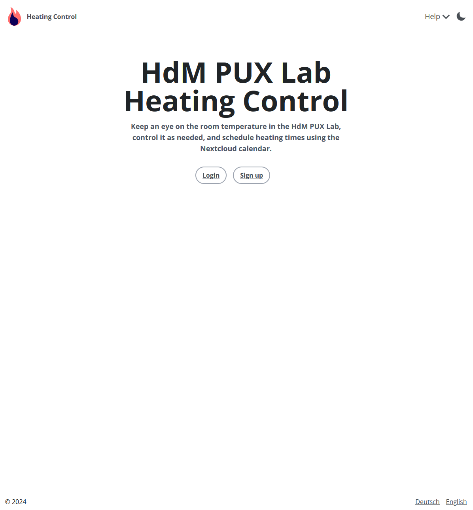
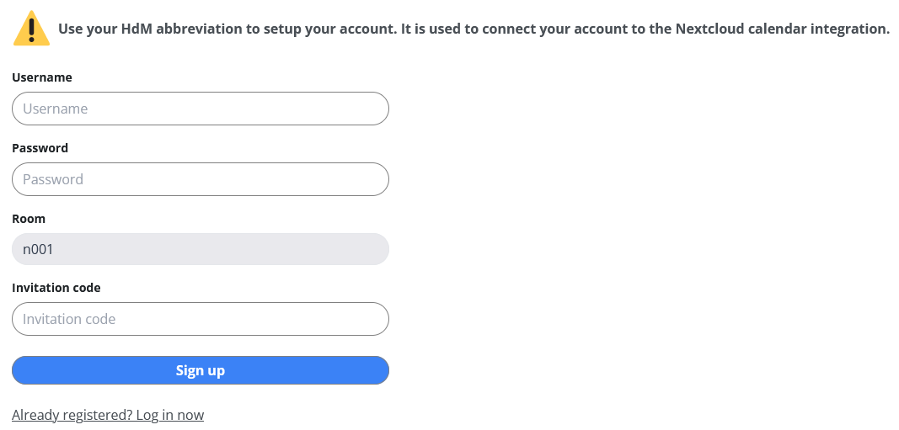
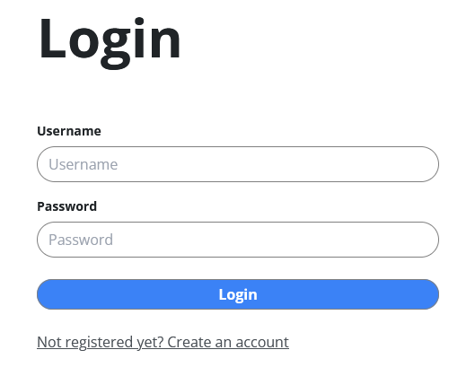
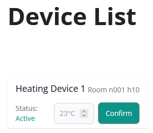
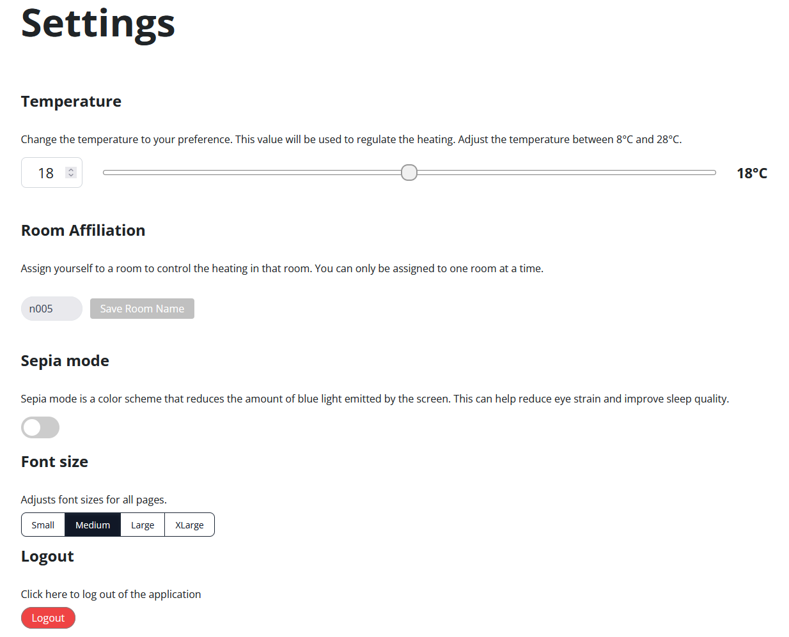
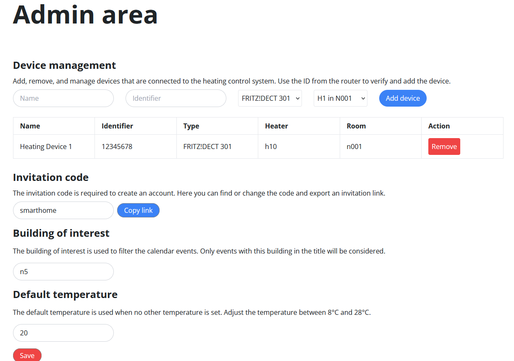

## Table of contents

- [User manual](#user-manual)
  - [Start Docker Container](#start-docker-container)
  - [Homepage](#homepage)
  - [Register](#register)
  - [Login](#login)
  - [Dashboard](#dashboard)
  - [Settings](#settings)
  - [Admin area](#admin-area)
  - [Troubleshooting](#troubleshooting)
---

# User manual


## Start Docker Container

- Start the Docker containers via Docker Compose:
  ```bash
  docker-compose up
  ```
- If active, go to `http://localhost:4321` in the browser.

---

## Homepage



1. you will find the language setting between German and English at the bottom right.
2. at the top right is the help call, which links to the operating instructions, installation instructions and information on the source code.
   - You can also switch the dark mode on or off with the sun/moon symbol.
3. in the centre are the login and register buttons.

---

## Register



1. if you are a new user, you need the invitation code from an admin.
2. enter your HdM abbreviation as user name (e.g. ab12).
3. enter a password that is at least 7 characters long.
4. select the room you are in.
5. finalise the registration.

---

## Login



1. enter your user name.
2. enter your password.
3. if the login is successful, you should be redirected to the dashboard.

---

## Dashboard


1. on the dashboard you can see the currently saved radiators that are relevant for your room.

---



2. in the device list, you can see the current information about the saved radiators.

---

## Settings



1. set the desired temperature: The radiators relevant to you are set to your saved temperature.
2. in the room assignment, you can customise your associated room.
3. you can optionally activate a sepia mode.
4. you can adjust the font size for all pages of the heating control.
5. finally, you can log out using the logout button.

---

## Admin area



This area is only visible to admins.

1. new devices can be added, managed and removed in the device management.
2. you can customise the invitation code and provide it as a link for a new user.
3) The building ID can be customised; this is important for the correct processing of NextCloud calendar events.
4. for the default temperature, you can select a temperature that will be used as the default value.

## Troubleshooting

- ### Registration failed
  1 **Use of HdM abbreviations as user names**
    - When registering in the system, it is essential that you use your HdM abbreviation as the user name. This abbreviation is crucial for the integration and smooth operation of the automated heating control system. Here are the reasons why it is necessary to use the HdM abbreviation as the user name:
      - Integration with NextCloud calendar: the system is directly linked to the NextCloud calendar. Using your HdM abbreviation allows the system to recognise and process your specific calendar entries. This is essential to determine when you will be physically present and to be able to set the heating according to your preferences in advance.
      - Personalised settings: By assigning the abbreviation to your account, the system can effectively manage your personalised settings, such as the desired heating temperature. This is the only way to ensure that the heating is regulated according to your individual needs.

  2 **What to do if the wrong user name was used during registration?
   - If an incorrect user name was selected during initial registration that does not correspond to your HdM abbreviation, it is necessary to create a new account. Please register again with your correct HdM code to ensure that all system functions work properly.